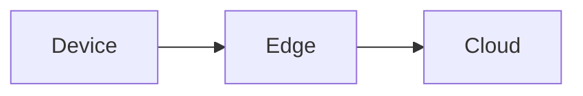

# Blog Feature Implementation Plan

> **For agentic workers:** REQUIRED SUB-SKILL: Use superpowers:subagent-driven-development (recommended) or superpowers:executing-plans to implement this plan task-by-task. Steps use checkbox (`- [ ]`) syntax for tracking.

**Goal:** Add a markdown-driven blog with tag pages, mermaid diagrams, and Vercel deployment to the existing portfolio site.

**Architecture:** Posts live as `.md` files in `src/posts/` with YAML frontmatter. A build-time loader (`lib/posts.ts`) parses them via `gray-matter`, validates required fields, computes reading time, and rewrites relative image paths to Vite-resolved URLs. Routing uses `react-router-dom` v6; blog routes are code-split. Markdown rendering uses `react-markdown` with remark/rehype plugins; fenced ``mermaid`` blocks are intercepted and rendered by a lazy-loaded `MermaidBlock`. All blog styling reuses existing CSS tokens. Deployment migrates from GitHub Pages to Vercel with an SPA rewrite.

**Tech Stack:** React 18 + Vite + TypeScript + SCSS + Vitest (existing) · `react-router-dom` v6 · `react-markdown` + `remark-gfm` + `rehype-slug` + `rehype-autolink-headings` + `rehype-highlight` · `gray-matter` · `mermaid` · `highlight.js`

**Spec:** `docs/superpowers/specs/2026-05-03-blog-design.md`

---

## File Structure

**New files**
- `src/lib/types.ts` — `Post`, `Frontmatter` types
- `src/lib/readingTime.ts` — word count to minutes
- `src/lib/posts.ts` — load, validate, sort, rewrite image paths, expose accessors
- `src/lib/posts.test.ts`
- `src/lib/readingTime.test.ts`
- `src/pages/Home.tsx` — current single-page content extracted
- `src/pages/BlogIndex.tsx`
- `src/pages/BlogPost.tsx`
- `src/pages/TagPage.tsx`
- `src/pages/NotFound.tsx`
- `src/components/MarkdownRenderer.tsx`
- `src/components/MermaidBlock.tsx`
- `src/components/PostCard.tsx`
- `src/components/PrevNextLinks.tsx`
- `src/styles/_blog.scss`
- `src/posts/2026-05-10-hello-world.md` — sample post for manual verify
- `vercel.json`

**Modified files**
- `src/App.tsx` — wrap in `BrowserRouter`, replace single-page tree with `<Routes>`
- `src/components/Nav.tsx` — add Blog link, scrollspy only on `/`, path-based active state on blog routes
- `src/styles/App.scss` — `@use "./blog";`
- `src/styles/index.scss` — import `highlight.js` theme
- `package.json` — add deps, drop `gh-pages` and deploy scripts
- `public/CNAME` — delete (Vercel manages domain)

---

## Task 1: Install dependencies

**Files:**
- Modify: `package.json`

- [ ] **Step 1: Install runtime deps**

Run:

```
npm install react-router-dom@^6 react-markdown@^9 gray-matter@^4 remark-gfm@^4 rehype-slug@^6 rehype-autolink-headings@^7 rehype-highlight@^7 highlight.js@^11 mermaid@^11
```

- [ ] **Step 2: Remove gh-pages**

Run:

```
npm uninstall gh-pages
```

- [ ] **Step 3: Drop deploy scripts from package.json**

Open `package.json`, remove the `predeploy` and `deploy` entries from `scripts`. Save.

- [ ] **Step 4: Verify build still works**

Run: `npm run build`
Expected: succeeds (no source changes yet, just deps).

- [ ] **Step 5: Commit**

```
git add package.json package-lock.json
git commit -m "feat(blog): add deps for markdown rendering and routing"
```

---

## Task 2: Types

**Files:**
- Create: `src/lib/types.ts`

- [ ] **Step 1: Create the types file**

```ts
// src/lib/types.ts
export interface Frontmatter {
    title: string;
    date: string;            // ISO date, e.g. "2026-05-10"
    summary: string;
    slug?: string;
    tags?: string[];
    draft?: boolean;
    cover?: string;
}

export interface Post {
    slug: string;
    title: string;
    date: string;
    summary: string;
    tags: string[];
    draft: boolean;
    cover?: string;
    body: string;            // raw markdown body, image paths rewritten
    readingTime: number;     // minutes, integer >= 1
}
```

- [ ] **Step 2: Commit**

```
git add src/lib/types.ts
git commit -m "feat(blog): add Post and Frontmatter types"
```

---

## Task 3: Reading time utility (TDD)

**Files:**
- Create: `src/lib/readingTime.ts`
- Test: `src/lib/readingTime.test.ts`

- [ ] **Step 1: Write the failing test**

```ts
// src/lib/readingTime.test.ts
import { describe, it, expect } from "vitest";
import { readingTime } from "./readingTime";

describe("readingTime", () => {
    it("returns at least 1 minute for short content", () => {
        expect(readingTime("hello world")).toBe(1);
    });

    it("computes minutes from word count at 200 wpm", () => {
        const text = Array(600).fill("word").join(" ");
        expect(readingTime(text)).toBe(3);
    });

    it("strips markdown syntax before counting", () => {
        const md = "# heading\n\n**bold** text and `code` and [link](http://x)";
        expect(readingTime(md)).toBe(1);
    });

    it("rounds up partial minutes", () => {
        const text = Array(250).fill("word").join(" ");
        expect(readingTime(text)).toBe(2);
    });
});
```

- [ ] **Step 2: Run test to verify it fails**

Run: `npx vitest run src/lib/readingTime.test.ts`
Expected: FAIL — module not found.

- [ ] **Step 3: Implement readingTime**

```ts
// src/lib/readingTime.ts
const WPM = 200;

export const readingTime = (markdown: string): number => {
    const text = markdown
        .replace(/```[\s\S]*?```/g, " ")
        .replace(/`[^`]*`/g, " ")
        .replace(/!\[[^\]]*\]\([^)]*\)/g, " ")
        .replace(/\[[^\]]*\]\([^)]*\)/g, " ")
        .replace(/[#>*_~`]/g, " ")
        .replace(/\s+/g, " ")
        .trim();
    const words = text ? text.split(" ").length : 0;
    return Math.max(1, Math.ceil(words / WPM));
};
```

- [ ] **Step 4: Run test to verify it passes**

Run: `npx vitest run src/lib/readingTime.test.ts`
Expected: PASS, 4 tests.

- [ ] **Step 5: Commit**

```
git add src/lib/readingTime.ts src/lib/readingTime.test.ts
git commit -m "feat(blog): add readingTime utility"
```

---

## Task 4: Posts parser (TDD)

**Files:**
- Create: `src/lib/posts.ts`
- Test: `src/lib/posts.test.ts`

- [ ] **Step 1: Write the failing test**

```ts
// src/lib/posts.test.ts
import { describe, it, expect } from "vitest";
import { parsePost, sortPosts, filterDrafts } from "./posts";

const validRaw = `---
title: Hello
date: 2026-05-10
summary: A test post
tags: ["a", "b"]
---
Body text.
`;

const draftRaw = `---
title: Draft
date: 2026-05-11
summary: Hidden
draft: true
---
Hidden body.
`;

const missingFieldRaw = `---
title: Missing summary
date: 2026-05-09
---
Body.
`;

describe("parsePost", () => {
    it("parses frontmatter and body", () => {
        const post = parsePost("2026-05-10-hello.md", validRaw);
        expect(post.title).toBe("Hello");
        expect(post.date).toBe("2026-05-10");
        expect(post.summary).toBe("A test post");
        expect(post.tags).toEqual(["a", "b"]);
        expect(post.body.trim()).toBe("Body text.");
        expect(post.readingTime).toBeGreaterThanOrEqual(1);
        expect(post.draft).toBe(false);
    });

    it("derives slug from filename when not in frontmatter", () => {
        const post = parsePost("2026-05-10-hello.md", validRaw);
        expect(post.slug).toBe("hello");
    });

    it("uses frontmatter slug when present", () => {
        const raw = validRaw.replace("title: Hello", "title: Hello\nslug: custom-slug");
        const post = parsePost("2026-05-10-hello.md", raw);
        expect(post.slug).toBe("custom-slug");
    });

    it("throws when required field missing", () => {
        expect(() => parsePost("2026-05-09-x.md", missingFieldRaw)).toThrow(/summary/);
    });

    it("defaults tags to empty array", () => {
        const raw = validRaw.replace(/tags:.*\n/, "");
        const post = parsePost("2026-05-10-hello.md", raw);
        expect(post.tags).toEqual([]);
    });
});

describe("sortPosts", () => {
    it("sorts by date descending", () => {
        const a = parsePost("2026-05-10-hello.md", validRaw);
        const b = parsePost("2026-05-11-draft.md", draftRaw);
        const sorted = sortPosts([a, b]);
        expect(sorted[0].slug).toBe("draft");
        expect(sorted[1].slug).toBe("hello");
    });
});

describe("filterDrafts", () => {
    it("removes drafts when isProd is true", () => {
        const a = parsePost("2026-05-10-hello.md", validRaw);
        const b = parsePost("2026-05-11-draft.md", draftRaw);
        expect(filterDrafts([a, b], true).map((p) => p.slug)).toEqual(["hello"]);
    });

    it("keeps drafts when isProd is false", () => {
        const a = parsePost("2026-05-10-hello.md", validRaw);
        const b = parsePost("2026-05-11-draft.md", draftRaw);
        expect(filterDrafts([a, b], false)).toHaveLength(2);
    });
});
```

- [ ] **Step 2: Run test to verify it fails**

Run: `npx vitest run src/lib/posts.test.ts`
Expected: FAIL — module not found.

- [ ] **Step 3: Implement parsePost, sortPosts, filterDrafts**

```ts
// src/lib/posts.ts
import matter from "gray-matter";
import type { Post } from "./types";
import { readingTime } from "./readingTime";

const REQUIRED = ["title", "date", "summary"] as const;

const slugFromFilename = (filename: string): string => {
    const base = filename.replace(/^.*\//, "").replace(/\.md$/, "");
    return base.replace(/^\d{4}-\d{2}-\d{2}-/, "");
};

export const parsePost = (filename: string, raw: string): Post => {
    const { data, content } = matter(raw);
    for (const field of REQUIRED) {
        if (!data[field]) {
            throw new Error(`Post ${filename}: missing required frontmatter field "${field}"`);
        }
    }
    const slug = (data.slug as string | undefined) ?? slugFromFilename(filename);
    return {
        slug,
        title: data.title,
        date: typeof data.date === "string" ? data.date : new Date(data.date).toISOString().slice(0, 10),
        summary: data.summary,
        tags: Array.isArray(data.tags) ? data.tags : [],
        draft: data.draft === true,
        cover: data.cover,
        body: content,
        readingTime: readingTime(content),
    };
};

export const sortPosts = (posts: Post[]): Post[] =>
    [...posts].sort((a, b) => (a.date < b.date ? 1 : a.date > b.date ? -1 : 0));

export const filterDrafts = (posts: Post[], isProd: boolean): Post[] =>
    isProd ? posts.filter((p) => !p.draft) : posts;
```

- [ ] **Step 4: Run test to verify it passes**

Run: `npx vitest run src/lib/posts.test.ts`
Expected: PASS, all describes green.

- [ ] **Step 5: Commit**

```
git add src/lib/posts.ts src/lib/posts.test.ts
git commit -m "feat(blog): add post parser, sorter, draft filter"
```

---

## Task 5: Glob loader and accessor functions

**Files:**
- Modify: `src/lib/posts.ts`

- [ ] **Step 1: Append the loader and accessors to `src/lib/posts.ts`**

```ts
// ── Build-time loading (Vite) ──
type RawModule = string;

const rawModules = import.meta.glob<RawModule>("../posts/*.md", {
    query: "?raw",
    import: "default",
    eager: true,
});

const allParsed: Post[] = Object.entries(rawModules).map(([path, raw]) =>
    parsePost(path, raw as string)
);

const visiblePosts: Post[] = sortPosts(filterDrafts(allParsed, import.meta.env.PROD));

export const getAllPosts = (): Post[] => visiblePosts;

export const getPostBySlug = (slug: string): Post | undefined =>
    visiblePosts.find((p) => p.slug === slug);

export const getPostsByTag = (tag: string): Post[] =>
    visiblePosts.filter((p) => p.tags.includes(tag));

export const getAllTags = (): string[] => {
    const set = new Set<string>();
    for (const p of visiblePosts) for (const t of p.tags) set.add(t);
    return Array.from(set).sort();
};

export const getNeighbors = (slug: string): { prev?: Post; next?: Post } => {
    const idx = visiblePosts.findIndex((p) => p.slug === slug);
    if (idx === -1) return {};
    return {
        next: idx > 0 ? visiblePosts[idx - 1] : undefined,
        prev: idx < visiblePosts.length - 1 ? visiblePosts[idx + 1] : undefined,
    };
};
```

- [ ] **Step 2: Verify the file still type-checks**

Run: `npx tsc --noEmit`
Expected: no errors. (No posts exist yet — `import.meta.glob` returns an empty record, which is valid.)

- [ ] **Step 3: Commit**

```
git add src/lib/posts.ts
git commit -m "feat(blog): add build-time post loader and accessors"
```

---

## Task 6: Image path rewriting

**Files:**
- Modify: `src/lib/posts.ts`
- Modify: `src/lib/posts.test.ts`

- [ ] **Step 1: Add the asset glob and rewriter to `src/lib/posts.ts`**

Insert at the top of the file, after the `import` statements:

```ts
const assetModules = import.meta.glob<string>(
    "../posts/**/*.{png,jpg,jpeg,svg,webp,gif}",
    { eager: true, query: "?url", import: "default" }
);

const assetUrlByRelativeKey: Record<string, string> = {};
for (const [absPath, url] of Object.entries(assetModules)) {
    const stripped = absPath.replace(/^\.\.\/posts\//, "");
    assetUrlByRelativeKey[stripped] = url as string;
}

const rewriteImagePaths = (slug: string, body: string): string =>
    body.replace(/(!\[[^\]]*\]\()\.\/([^)]+)\)/g, (_match, prefix: string, file: string) => {
        const key = `${slug}/${file}`;
        const url = assetUrlByRelativeKey[key];
        return url ? `${prefix}${url})` : `${prefix}./${file})`;
    });
```

- [ ] **Step 2: Wire rewriter into `parsePost`**

In `parsePost`, change `body: content` in the return object to:

```ts
body: rewriteImagePaths(slug, content),
```

- [ ] **Step 3: Add a unit test**

Append to `src/lib/posts.test.ts`:

```ts
describe("parsePost image rewriting", () => {
    it("leaves unmatched relative paths untouched", () => {
        const raw = `---
title: T
date: 2026-05-10
summary: S
---

`;
        const post = parsePost("2026-05-10-x.md", raw);
        expect(post.body).toContain("./missing.png");
    });
});
```

- [ ] **Step 4: Run tests**

Run: `npx vitest run src/lib/posts.test.ts`
Expected: PASS.

- [ ] **Step 5: Commit**

```
git add src/lib/posts.ts src/lib/posts.test.ts
git commit -m "feat(blog): rewrite relative image paths to Vite asset URLs"
```

---

## Task 7: Routing scaffold and Home page extraction

**Files:**
- Create: `src/pages/Home.tsx`
- Create: `src/pages/NotFound.tsx`
- Create stubs: `src/pages/BlogIndex.tsx`, `src/pages/BlogPost.tsx`, `src/pages/TagPage.tsx`
- Modify: `src/App.tsx`

- [ ] **Step 1: Create `src/pages/Home.tsx`**

```tsx
// src/pages/Home.tsx
import React, { useEffect } from "react";
import Introduction from "../components/Introduction";
import {
    LazyAboutMe,
    LazySkills,
    LazyProjectsSection,
    LazyContactMe,
} from "../components/LazyComponents";

const Home = () => {
    useEffect(() => {
        window.scrollTo(0, 0);
    }, []);

    return (
        <>
            <Introduction />
            <LazyAboutMe />
            <LazySkills />
            <LazyProjectsSection />
            <LazyContactMe />
        </>
    );
};

export default Home;
```

- [ ] **Step 2: Create `src/pages/NotFound.tsx`**

```tsx
// src/pages/NotFound.tsx
import React from "react";
import { Link } from "react-router-dom";

const NotFound = () => (
    <section className="section not-found">
        <h1 className="sub-heading">Not found</h1>
        <p>The page you are looking for does not exist.</p>
        <Link to="/">← back home</Link>
    </section>
);

export default NotFound;
```

- [ ] **Step 3: Create stub blog pages**

```tsx
// src/pages/BlogIndex.tsx
import React from "react";
const BlogIndex = () => <section className="section"><h1 className="sub-heading">Writing</h1></section>;
export default BlogIndex;
```

```tsx
// src/pages/BlogPost.tsx
import React from "react";
const BlogPost = () => <section className="section"><h1 className="sub-heading">Post</h1></section>;
export default BlogPost;
```

```tsx
// src/pages/TagPage.tsx
import React from "react";
const TagPage = () => <section className="section"><h1 className="sub-heading">Tag</h1></section>;
export default TagPage;
```

- [ ] **Step 4: Rewrite `src/App.tsx`**

```tsx
// src/App.tsx
import React, { lazy, Suspense } from "react";
import { BrowserRouter, Routes, Route } from "react-router-dom";
import "./styles/App.scss";
import Footer from "./components/Footer";
import Nav from "./components/Nav";
import Home from "./pages/Home";
import NotFound from "./pages/NotFound";
import { ThemeProvider } from "./contexts/ThemeContext";

const BlogIndex = lazy(() => import("./pages/BlogIndex"));
const BlogPost = lazy(() => import("./pages/BlogPost"));
const TagPage = lazy(() => import("./pages/TagPage"));

const Fallback = () => <div className="lazy-fallback" aria-hidden="true" />;

const App = () => (
    <ThemeProvider>
        <BrowserRouter>
            <div className="App">
                <a href="#intro" className="skip-to-content">
                    Skip to main content
                </a>
                <Nav />
                <main className="page">
                    <Suspense fallback={<Fallback />}>
                        <Routes>
                            <Route path="/" element={<Home />} />
                            <Route path="/blog" element={<BlogIndex />} />
                            <Route path="/blog/:slug" element={<BlogPost />} />
                            <Route path="/blog/tags/:tag" element={<TagPage />} />
                            <Route path="*" element={<NotFound />} />
                        </Routes>
                    </Suspense>
                </main>
                <Footer />
            </div>
        </BrowserRouter>
    </ThemeProvider>
);

export default App;
```

- [ ] **Step 5: Build to verify**

Run: `npm run build`
Expected: succeeds.

- [ ] **Step 6: Smoke test in dev**

Run: `npm run dev`. Visit `http://localhost:3000/` (home renders) and `http://localhost:3000/blog` (stub renders). Stop the server.

- [ ] **Step 7: Commit**

```
git add src/App.tsx src/pages/
git commit -m "feat(blog): add router, extract Home page, scaffold blog routes"
```

---

## Task 8: Nav update — Blog link and path-aware active state

**Files:**
- Modify: `src/components/Nav.tsx`

- [ ] **Step 1: Replace `src/components/Nav.tsx`**

```tsx
// src/components/Nav.tsx
import React, { useEffect, useState } from "react";
import { Link, useLocation } from "react-router-dom";
import { useTheme } from "../hooks/useTheme";
import lukeDark from "../assets/profile.png";
import lukeLight from "../assets/profile_lightmode.png";

interface PageLink {
    name: string;
    to: string;
    sectionId?: string;
    matchPrefix?: string;
}

const pages: PageLink[] = [
    { name: "About", to: "/#aboutMe", sectionId: "aboutMe" },
    { name: "Skills", to: "/#skills", sectionId: "skills" },
    { name: "Projects", to: "/#projectsSection", sectionId: "projectsSection" },
    { name: "Blog", to: "/blog", matchPrefix: "/blog" },
    { name: "Contact", to: "/#contact", sectionId: "contact" },
];

const Nav = () => {
    const { theme, toggleTheme } = useTheme();
    const { pathname } = useLocation();
    const [activeSectionId, setActiveSectionId] = useState<string>("");
    const [menuOpen, setMenuOpen] = useState<boolean>(false);

    useEffect(() => {
        if (pathname !== "/") {
            setActiveSectionId("");
            return;
        }
        const observer = new IntersectionObserver(
            (entries) => {
                const visible = entries
                    .filter((e) => e.isIntersecting)
                    .sort((a, b) => b.intersectionRatio - a.intersectionRatio);
                if (visible[0]) setActiveSectionId(visible[0].target.id);
            },
            { rootMargin: "-40% 0px -50% 0px", threshold: [0, 0.25, 0.5, 1] }
        );
        for (const p of pages) {
            if (!p.sectionId) continue;
            const el = document.getElementById(p.sectionId);
            if (el) observer.observe(el);
        }
        return () => observer.disconnect();
    }, [pathname]);

    useEffect(() => {
        document.body.style.overflow = menuOpen ? "hidden" : "";
        return () => {
            document.body.style.overflow = "";
        };
    }, [menuOpen]);

    const isActive = (page: PageLink): boolean => {
        if (page.matchPrefix) return pathname.startsWith(page.matchPrefix);
        if (pathname !== "/") return false;
        return page.sectionId === activeSectionId;
    };

    const scrollToHashIfHome = (e: React.MouseEvent, to: string) => {
        if (!to.startsWith("/#") || pathname !== "/") return;
        e.preventDefault();
        const hashOnly = to.slice(1);
        const target = document.querySelector(hashOnly);
        if (target) target.scrollIntoView({ behavior: "smooth", block: "start" });
        setMenuOpen(false);
    };

    return (
        <nav className="site-nav" aria-label="Primary">
            <Link
                to="/"
                className="site-nav-brand"
                aria-label="Home"
                onClick={() => setMenuOpen(false)}
            >
                
            </Link>

            <ul className={`site-nav-links ${menuOpen ? "is-open" : ""}`}>
                {pages.map((page) => (
                    <li key={page.to}>
                        <Link
                            to={page.to}
                            onClick={(e) => {
                                scrollToHashIfHome(e, page.to);
                                setMenuOpen(false);
                            }}
                            aria-current={isActive(page) ? "true" : undefined}
                        >
                            {page.name}
                        </Link>
                    </li>
                ))}
                <li>
                    <button
                        type="button"
                        className="theme-toggle"
                        onClick={toggleTheme}
                        title={
                            theme === "light"
                                ? "Switch to Return of the Jedi"
                                : "Switch to A New Hope"
                        }
                        aria-label={`Switch to ${theme === "light" ? "dark" : "light"} theme`}
                    >
                        {theme === "light" ? "Jedi" : "Hope"}
                    </button>
                </li>
            </ul>

            <button
                type="button"
                className="nav-hamburger"
                aria-label={menuOpen ? "Close menu" : "Open menu"}
                aria-expanded={menuOpen}
                onClick={() => setMenuOpen((o) => !o)}
            >
                <span className={`bar ${menuOpen ? "open" : ""}`} />
                <span className={`bar ${menuOpen ? "open" : ""}`} />
                <span className={`bar ${menuOpen ? "open" : ""}`} />
            </button>
        </nav>
    );
};

export default Nav;
```

- [ ] **Step 2: Build**

Run: `npm run build`
Expected: succeeds.

- [ ] **Step 3: Smoke test**

Run: `npm run dev`. Visit `/`, verify scrollspy still highlights sections. Visit `/blog`, verify Blog link is highlighted, no scrollspy errors in console. Stop server.

- [ ] **Step 4: Commit**

```
git add src/components/Nav.tsx
git commit -m "feat(blog): add Blog link, route-aware active state in Nav"
```

---

## Task 9: PostCard component

**Files:**
- Create: `src/components/PostCard.tsx`

- [ ] **Step 1: Create the file**

```tsx
// src/components/PostCard.tsx
import React from "react";
import { Link } from "react-router-dom";
import type { Post } from "../lib/types";

interface Props {
    post: Post;
}

const formatDate = (iso: string): string => {
    const d = new Date(iso);
    return d.toLocaleDateString("en-AU", {
        year: "numeric",
        month: "short",
        day: "numeric",
    });
};

const PostCard = ({ post }: Props) => (
    <article className="post-card">
        <Link to={`/blog/${post.slug}`} className="post-card-link">
            <p className="post-card-meta">
                {formatDate(post.date)} · {post.readingTime} min read
            </p>
            <h3 className="post-card-title">{post.title}</h3>
            <p className="post-card-summary">{post.summary}</p>
            {post.tags.length > 0 && (
                <ul className="post-card-tags">
                    {post.tags.map((tag) => (
                        <li key={tag} className="skill-chip">{tag}</li>
                    ))}
                </ul>
            )}
        </Link>
    </article>
);

export default PostCard;
```

- [ ] **Step 2: Commit**

```
git add src/components/PostCard.tsx
git commit -m "feat(blog): add PostCard component"
```

---

## Task 10: BlogIndex page

**Files:**
- Modify: `src/pages/BlogIndex.tsx`

- [ ] **Step 1: Replace stub with full implementation**

```tsx
// src/pages/BlogIndex.tsx
import React, { useEffect } from "react";
import { Link } from "react-router-dom";
import { getAllPosts, getAllTags } from "../lib/posts";
import PostCard from "../components/PostCard";

const BlogIndex = () => {
    const posts = getAllPosts();
    const tags = getAllTags();

    useEffect(() => {
        document.title = "Blog · Luke Banicevic";
    }, []);

    return (
        <section className="section blog-index">
            <h1 className="sub-heading">Writing</h1>

            {tags.length > 0 && (
                <ul className="blog-tag-row" aria-label="Filter by tag">
                    {tags.map((tag) => (
                        <li key={tag}>
                            <Link to={`/blog/tags/${tag}`} className="skill-chip">
                                #{tag}
                            </Link>
                        </li>
                    ))}
                </ul>
            )}

            {posts.length === 0 ? (
                <p className="blog-empty">No posts yet.</p>
            ) : (
                <div className="post-list">
                    {posts.map((p) => (
                        <PostCard key={p.slug} post={p} />
                    ))}
                </div>
            )}
        </section>
    );
};

export default BlogIndex;
```

- [ ] **Step 2: Build**

Run: `npm run build`
Expected: succeeds, even with zero posts.

- [ ] **Step 3: Commit**

```
git add src/pages/BlogIndex.tsx
git commit -m "feat(blog): implement BlogIndex page"
```

---

## Task 11: MermaidBlock (lazy)

**Files:**
- Create: `src/components/MermaidBlock.tsx`

- [ ] **Step 1: Create the component**

```tsx
// src/components/MermaidBlock.tsx
import React, { useEffect, useRef, useState } from "react";

interface Props {
    code: string;
}

let mermaidPromise: Promise<typeof import("mermaid")> | null = null;
const loadMermaid = () => {
    if (!mermaidPromise) mermaidPromise = import("mermaid");
    return mermaidPromise;
};

const buildThemeVars = () => {
    const cs = getComputedStyle(document.documentElement);
    return {
        background: cs.getPropertyValue("--bg-elev").trim(),
        primaryColor: cs.getPropertyValue("--bg-elev").trim(),
        primaryTextColor: cs.getPropertyValue("--text").trim(),
        primaryBorderColor: cs.getPropertyValue("--border-strong").trim(),
        lineColor: cs.getPropertyValue("--text-muted").trim(),
        textColor: cs.getPropertyValue("--text").trim(),
    };
};

let idCounter = 0;
const nextId = () => `mermaid-${++idCounter}`;

const MermaidBlock = ({ code }: Props) => {
    const ref = useRef<HTMLDivElement>(null);
    const [error, setError] = useState<string | null>(null);

    useEffect(() => {
        let cancelled = false;
        const render = async () => {
            try {
                const { default: mermaid } = await loadMermaid();
                mermaid.initialize({
                    startOnLoad: false,
                    theme: "base",
                    themeVariables: buildThemeVars(),
                    securityLevel: "strict",
                });
                const id = nextId();
                const { svg } = await mermaid.render(id, code);
                if (!cancelled && ref.current) ref.current.innerHTML = svg;
            } catch (e) {
                if (!cancelled) setError(String(e));
            }
        };
        render();
        return () => {
            cancelled = true;
        };
    }, [code]);

    if (error) {
        return <pre className="mermaid-fallback"><code>{code}</code></pre>;
    }
    return <div ref={ref} className="mermaid-block" aria-label="diagram" />;
};

export default MermaidBlock;
```

- [ ] **Step 2: Commit**

```
git add src/components/MermaidBlock.tsx
git commit -m "feat(blog): add lazy MermaidBlock for fenced mermaid diagrams"
```

---

## Task 12: MarkdownRenderer

**Files:**
- Create: `src/components/MarkdownRenderer.tsx`
- Modify: `src/styles/index.scss`

- [ ] **Step 1: Add highlight theme to `src/styles/index.scss`**

```scss
@import "highlight.js/styles/github-dark-dimmed.css";

html {
    scroll-behavior: smooth;
    min-height: 100vh;
}

body {
    margin: 0;
    padding: 0;
    overflow-x: hidden;
}
```

- [ ] **Step 2: Create the renderer**

```tsx
// src/components/MarkdownRenderer.tsx
import React from "react";
import ReactMarkdown from "react-markdown";
import remarkGfm from "remark-gfm";
import rehypeSlug from "rehype-slug";
import rehypeAutolinkHeadings from "rehype-autolink-headings";
import rehypeHighlight from "rehype-highlight";
import MermaidBlock from "./MermaidBlock";

interface Props {
    body: string;
}

const MarkdownRenderer = ({ body }: Props) => (
    <ReactMarkdown
        remarkPlugins={[remarkGfm]}
        rehypePlugins={[
            rehypeSlug,
            [rehypeAutolinkHeadings, { behavior: "wrap" }],
            rehypeHighlight,
        ]}
        components={{
            code({ className, children, ...rest }) {
                const match = /language-(\w+)/.exec(className ?? "");
                const lang = match?.[1];
                if (lang === "mermaid") {
                    return <MermaidBlock code={String(children).trim()} />;
                }
                return (
                    <code className={className} {...rest}>
                        {children}
                    </code>
                );
            },
        }}
    >
        {body}
    </ReactMarkdown>
);

export default MarkdownRenderer;
```

- [ ] **Step 3: Build**

Run: `npm run build`
Expected: succeeds.

- [ ] **Step 4: Commit**

```
git add src/components/MarkdownRenderer.tsx src/styles/index.scss
git commit -m "feat(blog): add MarkdownRenderer with mermaid intercept"
```

---

## Task 13: PrevNextLinks component

**Files:**
- Create: `src/components/PrevNextLinks.tsx`

- [ ] **Step 1: Create the component**

```tsx
// src/components/PrevNextLinks.tsx
import React from "react";
import { Link } from "react-router-dom";
import type { Post } from "../lib/types";

interface Props {
    prev?: Post;
    next?: Post;
}

const PrevNextLinks = ({ prev, next }: Props) => {
    if (!prev && !next) return null;
    return (
        <nav className="prev-next" aria-label="Post navigation">
            <div className="prev-next-cell">
                {prev && (
                    <Link to={`/blog/${prev.slug}`}>
                        <span className="prev-next-label">← Older</span>
                        <span className="prev-next-title">{prev.title}</span>
                    </Link>
                )}
            </div>
            <div className="prev-next-cell prev-next-right">
                {next && (
                    <Link to={`/blog/${next.slug}`}>
                        <span className="prev-next-label">Newer →</span>
                        <span className="prev-next-title">{next.title}</span>
                    </Link>
                )}
            </div>
        </nav>
    );
};

export default PrevNextLinks;
```

- [ ] **Step 2: Commit**

```
git add src/components/PrevNextLinks.tsx
git commit -m "feat(blog): add PrevNextLinks component"
```

---

## Task 14: BlogPost page

**Files:**
- Modify: `src/pages/BlogPost.tsx`

- [ ] **Step 1: Replace stub**

```tsx
// src/pages/BlogPost.tsx
import React, { useEffect } from "react";
import { Link, useParams } from "react-router-dom";
import { getPostBySlug, getNeighbors } from "../lib/posts";
import MarkdownRenderer from "../components/MarkdownRenderer";
import PrevNextLinks from "../components/PrevNextLinks";
import NotFound from "./NotFound";

const formatDate = (iso: string): string =>
    new Date(iso).toLocaleDateString("en-AU", {
        year: "numeric",
        month: "long",
        day: "numeric",
    });

const BlogPost = () => {
    const { slug = "" } = useParams<{ slug: string }>();
    const post = getPostBySlug(slug);
    const { prev, next } = getNeighbors(slug);

    useEffect(() => {
        if (post) document.title = `${post.title} · Luke Banicevic`;
    }, [post]);

    useEffect(() => {
        window.scrollTo(0, 0);
    }, [slug]);

    if (!post) return <NotFound />;

    return (
        <article className="section blog-post">
            <header className="blog-post-header">
                <h1 className="blog-post-title">{post.title}</h1>
                <p className="blog-post-meta">
                    {formatDate(post.date)} · {post.readingTime} min read
                </p>
                {post.tags.length > 0 && (
                    <ul className="blog-post-tags">
                        {post.tags.map((tag) => (
                            <li key={tag}>
                                <Link to={`/blog/tags/${tag}`} className="skill-chip">
                                    #{tag}
                                </Link>
                            </li>
                        ))}
                    </ul>
                )}
            </header>

            <div className="blog-post-body">
                <MarkdownRenderer body={post.body} />
            </div>

            <PrevNextLinks prev={prev} next={next} />
        </article>
    );
};

export default BlogPost;
```

- [ ] **Step 2: Build**

Run: `npm run build`
Expected: succeeds.

- [ ] **Step 3: Commit**

```
git add src/pages/BlogPost.tsx
git commit -m "feat(blog): implement BlogPost page"
```

---

## Task 14b: BlogPost render test

**Files:**
- Create: `src/pages/BlogPost.test.tsx`

This satisfies the spec's lightweight component-test requirement. We render a fixture post and assert the title, date, and reading time appear.

- [ ] **Step 1: Write the test**

```tsx
// src/pages/BlogPost.test.tsx
import React from "react";
import { describe, it, expect, vi } from "vitest";
import { render, screen } from "@testing-library/react";
import { MemoryRouter, Routes, Route } from "react-router-dom";

vi.mock("../lib/posts", () => ({
    getPostBySlug: (slug: string) =>
        slug === "hello"
            ? {
                  slug: "hello",
                  title: "Hello",
                  date: "2026-05-10",
                  summary: "S",
                  tags: ["meta"],
                  draft: false,
                  body: "Body content here.",
                  readingTime: 1,
              }
            : undefined,
    getNeighbors: () => ({}),
}));

import BlogPost from "./BlogPost";

const renderAt = (path: string) =>
    render(
        <MemoryRouter initialEntries={[path]}>
            <Routes>
                <Route path="/blog/:slug" element={<BlogPost />} />
            </Routes>
        </MemoryRouter>
    );

describe("BlogPost", () => {
    it("renders title, date, reading time, and body for a known slug", () => {
        renderAt("/blog/hello");
        expect(screen.getByRole("heading", { name: "Hello" })).toBeTruthy();
        expect(screen.getByText(/1 min read/)).toBeTruthy();
        expect(screen.getByText(/Body content here\./)).toBeTruthy();
    });

    it("renders NotFound when slug is unknown", () => {
        renderAt("/blog/missing");
        expect(screen.getByRole("heading", { name: /Not found/i })).toBeTruthy();
    });
});
```

- [ ] **Step 2: Run the test**

Run: `npx vitest run src/pages/BlogPost.test.tsx`
Expected: PASS, 2 tests.

- [ ] **Step 3: Commit**

```
git add src/pages/BlogPost.test.tsx
git commit -m "test(blog): add BlogPost render test"
```

---

## Task 15: TagPage

**Files:**
- Modify: `src/pages/TagPage.tsx`

- [ ] **Step 1: Replace stub**

```tsx
// src/pages/TagPage.tsx
import React, { useEffect } from "react";
import { Link, useParams } from "react-router-dom";
import { getPostsByTag } from "../lib/posts";
import PostCard from "../components/PostCard";
import NotFound from "./NotFound";

const TagPage = () => {
    const { tag = "" } = useParams<{ tag: string }>();
    const posts = getPostsByTag(tag);

    useEffect(() => {
        document.title = `#${tag} · Luke Banicevic`;
    }, [tag]);

    if (posts.length === 0) return <NotFound />;

    return (
        <section className="section tag-page">
            <h1 className="sub-heading">tag: {tag}</h1>
            <Link to="/blog" className="tag-page-back">← all posts</Link>
            <div className="post-list">
                {posts.map((p) => (
                    <PostCard key={p.slug} post={p} />
                ))}
            </div>
        </section>
    );
};

export default TagPage;
```

- [ ] **Step 2: Build**

Run: `npm run build`
Expected: succeeds.

- [ ] **Step 3: Commit**

```
git add src/pages/TagPage.tsx
git commit -m "feat(blog): implement TagPage"
```

---

## Task 16: Blog styles

**Files:**
- Create: `src/styles/_blog.scss`
- Modify: `src/styles/App.scss`

- [ ] **Step 1: Create `src/styles/_blog.scss`**

```scss
.blog-tag-row {
    list-style: none;
    margin: 0 0 var(--space-6);
    padding: 0;
    display: flex;
    flex-wrap: wrap;
    gap: var(--space-2);
}

.blog-empty {
    color: var(--text-muted);
}

.post-list {
    display: flex;
    flex-direction: column;
    gap: var(--space-5);
}

.post-card {
    border: 1px solid var(--border);
    background: var(--bg-elev);
    transition: border-color 0.15s ease;

    &:hover {
        border-color: var(--border-strong);
    }
}

.post-card-link {
    display: block;
    padding: var(--space-5);
    color: inherit;

    &:hover {
        text-decoration: none;
    }
}

.post-card-meta {
    font-size: 0.75rem;
    color: var(--text-muted);
    letter-spacing: 0.04em;
    margin: 0 0 var(--space-2);
}

.post-card-title {
    font-size: 1.05rem;
    color: var(--text);
    margin: 0 0 var(--space-2);
}

.post-card-summary {
    color: var(--text-muted);
    font-size: 0.9rem;
    margin: 0 0 var(--space-3);
}

.post-card-tags {
    list-style: none;
    margin: 0;
    padding: 0;
    display: flex;
    flex-wrap: wrap;
    gap: var(--space-2);
}

.tag-page-back {
    display: inline-block;
    margin-bottom: var(--space-5);
    font-size: 0.85rem;
}

.blog-post {
    max-width: 64ch;
}

.blog-post-header {
    margin-bottom: var(--space-7);
}

.blog-post-title {
    font-size: clamp(1.75rem, 5vw, 2.5rem);
    margin: 0 0 var(--space-3);
    color: var(--text);
    line-height: 1.15;
    letter-spacing: -0.01em;
}

.blog-post-meta {
    color: var(--text-muted);
    font-size: 0.85rem;
    letter-spacing: 0.04em;
    margin: 0 0 var(--space-4);
}

.blog-post-tags {
    list-style: none;
    margin: 0;
    padding: 0;
    display: flex;
    flex-wrap: wrap;
    gap: var(--space-2);
}

.blog-post-body {
    font-size: 0.95rem;
    line-height: 1.7;
    color: var(--text);

    h2,
    h3 {
        margin: var(--space-7) 0 var(--space-4);
        color: var(--text);

        &::before {
            content: "// ";
            color: var(--accent);
        }
    }

    h2 { font-size: 1.25rem; }
    h3 { font-size: 1.05rem; }

    p {
        margin: 0 0 var(--space-4);
    }

    a {
        color: var(--accent);
        &:hover { text-decoration: underline; }
    }

    ul, ol {
        margin: 0 0 var(--space-4);
        padding-left: var(--space-5);
    }

    li {
        margin-bottom: var(--space-2);
    }

    blockquote {
        border-left: 2px solid var(--accent);
        padding-left: var(--space-4);
        color: var(--text-muted);
        margin: var(--space-4) 0;
    }

    pre {
        background: var(--bg-elev);
        border: 1px solid var(--border);
        padding: var(--space-4);
        overflow-x: auto;
        font-size: 0.85rem;
        margin: 0 0 var(--space-4);
    }

    code {
        font-family: inherit;
    }

    p > code,
    li > code {
        background: var(--bg-elev);
        border: 1px solid var(--border);
        padding: 0.1rem 0.35rem;
        font-size: 0.85em;
    }

    img {
        max-width: 100%;
        height: auto;
        border: 1px solid var(--border);
        margin: var(--space-4) 0;
    }
}

.mermaid-block {
    margin: var(--space-5) 0;
    text-align: center;
    overflow-x: auto;
}

.mermaid-fallback {
    background: var(--bg-elev);
    border: 1px solid var(--border);
    padding: var(--space-4);
    font-size: 0.8rem;
    color: var(--text-muted);
}

.prev-next {
    display: grid;
    grid-template-columns: 1fr 1fr;
    gap: var(--space-4);
    margin-top: var(--space-8);
    padding-top: var(--space-5);
    border-top: 1px solid var(--border);
}

.prev-next-cell a {
    display: block;
    color: inherit;

    &:hover {
        text-decoration: none;
        .prev-next-title { color: var(--accent); }
    }
}

.prev-next-right {
    text-align: right;
}

.prev-next-label {
    display: block;
    font-size: 0.75rem;
    color: var(--text-muted);
    margin-bottom: var(--space-1);
    letter-spacing: 0.04em;
}

.prev-next-title {
    display: block;
    font-size: 0.9rem;
    color: var(--text);
    transition: color 0.15s ease;
}

.not-found {
    text-align: center;
}

@media (max-width: 600px) {
    .prev-next {
        grid-template-columns: 1fr;
    }
    .prev-next-right {
        text-align: left;
    }
}
```

- [ ] **Step 2: Append to `src/styles/App.scss`**

Add this single line at the very bottom of `src/styles/App.scss`:

```scss
@use "./blog";
```

- [ ] **Step 3: Build**

Run: `npm run build`
Expected: succeeds.

- [ ] **Step 4: Commit**

```
git add src/styles/_blog.scss src/styles/App.scss
git commit -m "feat(blog): add blog stylesheet partial"
```

---

## Task 17: Sample post for verification

**Files:**
- Create: `src/posts/2026-05-10-hello-world.md`

- [ ] **Step 1: Create the sample post**

Create `src/posts/2026-05-10-hello-world.md` with the exact content shown below. The outer fence here is four backticks so that the inner three-backtick fences are preserved verbatim — copy everything **between** the outer fences (do not include the outer four-backtick lines themselves).

````markdown
---
title: Hello, world
date: 2026-05-10
summary: First post on the new blog. Wiring it up end-to-end.
tags: ["meta"]
---

This is the first post on the new blog. It exists to verify that markdown,
syntax highlighting, and mermaid all render correctly.

## A code block

```ts
const greet = (name: string) => `hello, ${name}`;
greet("world");
```

## A diagram



## A list

- markdown
- code highlighting
- diagrams
````

- [ ] **Step 2: Run dev server and verify**

Run: `npm run dev`. Visit `http://localhost:3000/blog`. Confirm:
- Post card appears with title, date, "1 min read", `meta` tag
- Click into post; renders title, body, code block with highlighting, mermaid diagram, list
- Click `#meta` → `/blog/tags/meta` shows the post
- No console errors
Stop server.

- [ ] **Step 3: Commit**

```
git add src/posts/
git commit -m "feat(blog): add sample hello-world post"
```

---

## Task 18: Vercel deployment migration

**Files:**
- Create: `vercel.json`
- Delete: `public/CNAME`
- Modify: `README.md`

- [ ] **Step 1: Create `vercel.json` at repo root**

```json
{
  "rewrites": [
    { "source": "/(.*)", "destination": "/" }
  ]
}
```

- [ ] **Step 2: Delete `public/CNAME`**

Run: `rm public/CNAME`

- [ ] **Step 3: Update README deploy section**

Open `README.md`. Find any GitHub Pages deploy instructions and replace with: "Deployed automatically by Vercel on push to `main`. Custom domain configured via Vercel dashboard."

- [ ] **Step 4: Build to verify**

Run: `npm run build`
Expected: succeeds.

- [ ] **Step 5: Commit**

```
git add vercel.json README.md
git rm public/CNAME
git commit -m "chore: migrate deployment from GitHub Pages to Vercel"
```

- [ ] **Step 6: Manual platform steps (operator)**

These are not code changes; document them for the operator to perform once after merge:
1. Connect repo to Vercel via dashboard, accept defaults (Vite framework auto-detected)
2. In Vercel project settings → Domains, add the custom domain that was in `public/CNAME`
3. Update DNS at the domain registrar to point to Vercel (CNAME `cname.vercel-dns.com` or A records per Vercel docs)
4. Once DNS propagates, archive the old `gh-pages` branch

---

## Task 19: Final integration verify

**Files:** none (verification only)

- [ ] **Step 1: Full test pass**

Run: `npx vitest run`
Expected: all tests pass (readingTime + posts).

- [ ] **Step 2: Type check**

Run: `npx tsc --noEmit`
Expected: no errors.

- [ ] **Step 3: Production build**

Run: `npm run build`
Expected: succeeds; bundle includes lazy chunks for `BlogIndex`, `BlogPost`, `TagPage`, and a separate `mermaid` chunk that only loads if a mermaid block renders.

- [ ] **Step 4: Manual smoke test**

Run: `npm run dev`. Verify:
- `/` renders unchanged
- `/blog` renders the sample post in the list
- `/blog/hello-world` renders the post with code highlighting and mermaid diagram
- `/blog/tags/meta` renders the post under the tag
- `/blog/does-not-exist` renders NotFound
- Theme toggle still works on every route
- Mobile hamburger still works
- No console errors

- [ ] **Step 5: Push and let Vercel deploy**

Run: `git push origin main`

Confirm the Vercel deployment succeeds in the dashboard, hit the live URL, repeat the smoke checks against production.

---

## Done

A working markdown blog with tag pages, mermaid diagrams, prev/next navigation, and Vercel deployment. To publish: drop a new `.md` file into `src/posts/`, commit, push.
