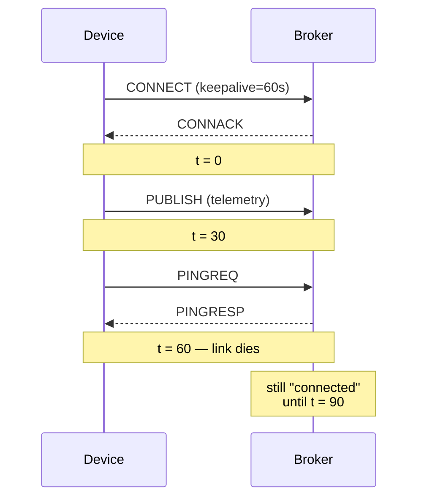

A keepalive in MQTT is not a heartbeat. It is a contract: the client promises to
send *something* — a `PINGREQ` if it has nothing else to say — within the
keepalive interval. The broker promises to disconnect the client if it doesn't
hear from it within **1.5 × keepalive** seconds.

That 1.5× multiplier is where most "ghost device" bugs live.

## The default trap

If you set `keepalive: 60`, your broker will hold the session open for up to
**90 seconds** of silence before declaring the client dead. For a battery-powered
device on a flaky cellular link, that's an eternity of telemetry going into the
void while your dashboard still shows the device as connected.

## A more honest mental model



The broker has no way to tell a quiet device from a dead one until the deadline
passes. Anything you build on top of "is the client connected" inherits that
delay.

## What to actually do

1. **Pick a keepalive that matches your latency budget.** If a clinician must
   know within 30 seconds that a device is offline, `keepalive: 20` is the
   ceiling. Battery cost goes up; that's the trade.

2. **Don't rely on the connected state alone.** Track the timestamp of the last
   message you actually accepted at the application layer. If it's stale, the
   device is offline regardless of what the session says.

3. **Use Last Will and Testament.** Configure the client so the broker publishes
   a "device offline" message on its behalf when it disconnects. Subscribers
   learn about the death without polling.

A short bit of pseudo-code that captures the receiving side:

```ts
const STALE_MS = 90_000;

function isOnline(deviceId: string): boolean {
    const lastSeen = telemetryStore.lastMessageAt(deviceId);
    if (!lastSeen) return false;
    return Date.now() - lastSeen < STALE_MS;
}
```

That single function has saved me more grief than any broker-side dashboard.

## The real lesson

Connection state is a hint, not a fact. The fact lives in your data plane —
when you last accepted a payload that made sense. Treat the broker's view as
advisory, and your "device is online" indicator stops lying to you.
